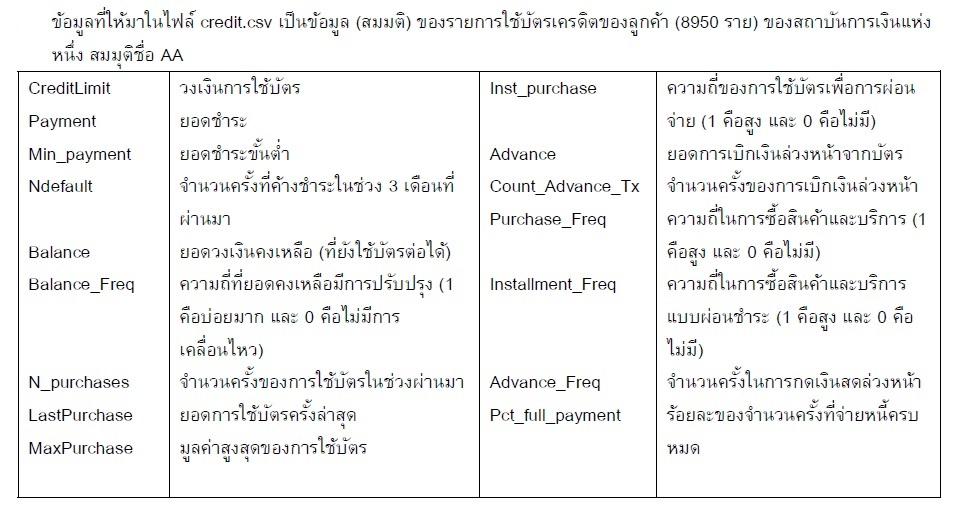
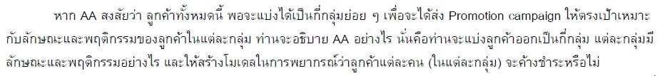

# Money Credit

ข้อมูลเป็นข้อมูลสมมุติการใช้บัตรเครดิตของลูกค้าจากสถาบันการเงินแห่งนึง มีทั้งหมด 8950 ราย วัตถุประสงค์ของงานคือแบ่งลูกค้าเป็นกลุ่มย่อยเพื่อ
ศึกษาพฤติกรรม โดยข้อมูลจะมี วงเงินการใช้บัตร ยอดชำระทั้งหมด ยอดชำระขั้นต่ำ จำนวนครั้งที่ค้างชำระใน 3 เดือนที่ผ่านมา ยอดวงเงินคงเหลือ ความถี่ในการปรับยอดวงเงินคงเหลือ จำนวนครั้งในการใช้บัตร 3 เดือนที่ผ่านมา มูลค่าสูงสุดในการใช้บัตร ยอดการเบิกเงินล่วงหน้า จำนวนครั้งในการเบิกเงินล่วงหน้า ความถี่ในการซื้อสินค้าและบริการ ความในการซื้อสินค้าและบริการ(ผ่อน) ร้อยละจำนวนครั้งที่จ่ายหนี้ครบ
ขั้นตอนแรก ดูรายละเอียด ตัดบาง column ทิ้ง ใช้ elbow method เพื่อดูว่าควรแบ่งลูกค้าเป็นกี่กลุ่มย่อย จากนั้นแสดงจุด centroiad แต่ละ feature ทุกกลุ่มเพื่อดูพฤติกรรม จากนั้นแยก data set เป็นกลุ่มย่อยและแบ่งข้อมูล train กับ test
algo ที่เลือกใช้มี 3 ตัว คือ decision tree , neural network , random forest

The entire data is made up credit card details obtained from a financial institution. There are 8950 forms in all. The work aim is divided into subgroups as order to educate behavior. 
The most costly pay, credit card cap, payment amount, payment amount(minimum), overdue paying(past 3 months), balance, balance adjust frequency, credit card using time in the previous three months, money advance amount, frequency of money advance amount, credit card using frequency, credit card using frequency(installment), and pay off debt percentage are all factors to consider.

link to answer